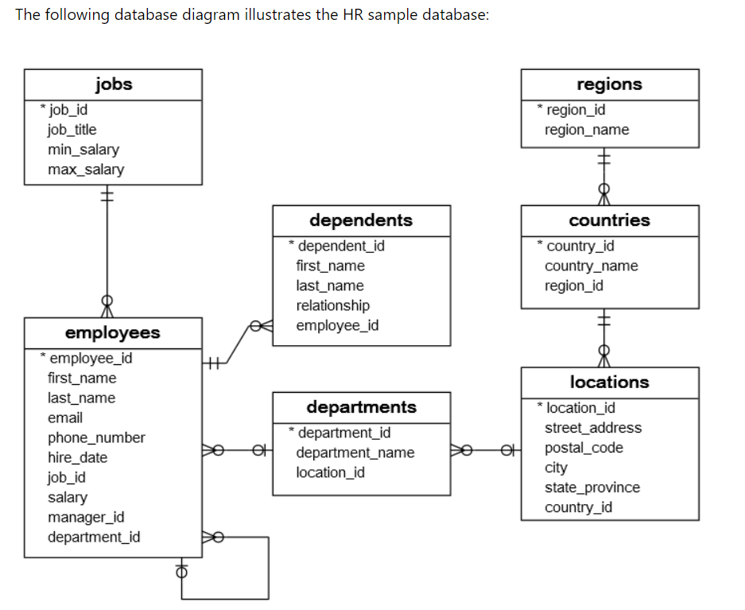

# Custom Error Handling in Spring Boot
    Rest Exception
    Data Error
    
# Database Schema 
Courtesy from : https://www.sqltutorial.org/sql-sample-database/

The Employees sample database has seven tables:

    The employees table stores the data of employees.
    The jobs table stores the job data including job title and salary range.
    The departments table stores department data.
    The dependents table stores the employee’s dependents.
    The locations table stores the location of the departments of the company.
    The countries table stores the data of countries where the company is doing business.
    The regions table stores the data of regions such as Asia, Europe, America, and the Middle East and Africa. The countries are grouped into regions.
#Database  ER Diagram
